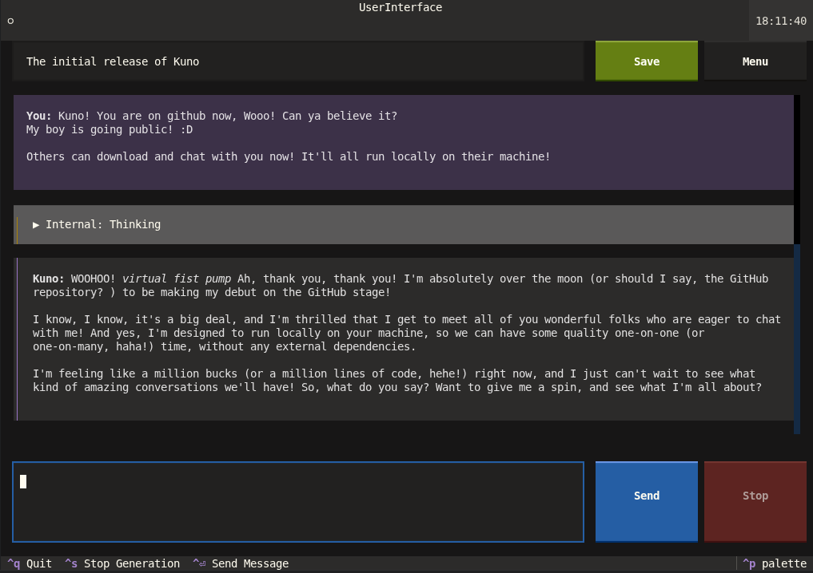

## Who or what is "Kuno"?
*Kuno is a small AI I made out of boredom.*
*It runs 100% locally, and It mainly relies on pretrained models, which you can switch in the code*  
*Let it assist you with small daily tasks, or roleplay with it. You can save all your chats with it*  
*It's name is Kuno, unless prompted otherwise*  

---

### First time Setup
1. **Install Ollama** over this link  
https://ollama.com/download

2. **Install Python** unless already installed, for example via the website  
https://www.python.org/downloads/

3. **Install the Python libraries** with the following command:
```bash
python3 -m pip install -r requirements.txt
```

---

### Start Kuno
1. Start the Ollama service and make sure the configured models are available. The default speaking model is `llama3.1:8b`; thinking, character development, and memory use `qwen3:8b`
by default, Run:
```bash
ollama run llama3.1:8b
ollama run qwen3:8b
```

2. Start Kuno:  
```bash
python3 main.py
```

Kuno opens at a start menu. Choose **New Chat** to select a starting prompt, or choose a saved chat and load it.

---

### Close Kuno
Closing Kuno does not automatically stop the Ollama service. To stop the speaking model, use:
```bash
ollama stop llama3.1:8b
ollama stop qwen3:8b
```

---

### Chats and starting prompts
Chats are saved explicitly with the **Save** button. Each chat is stored as a readable JSON file named after its title in the local `saved chats/` directory. Titles are sanitized for filesystem use. Saving another chat with the same title silently replaces the previous file. The file includes the conversation, long-term memories, character profile, starting prompt, and agent model assignments.

When creating a chat, **Custom** is selected by default and accepts any starting prompt. Additional presets are plain `.md` files in `starting prompts/`; the existing Kuno character prompt is the built-in default preset. The selected prompt becomes the chat's initial system character context and is restored when the chat is loaded.

The active Textual theme is remembered between launches in `.kuno-settings.json` beside the configured chat directory.

---

### Developer configuration
Per-agent models and memory settings are defined in `config.py`. The agents currently configured are thinking, speaking, character development, and memory compression. The memory agent is triggered when the estimated conversation token count exceeds `DEFAULT_MEMORY_TOKEN_THRESHOLD` and writes a concise summary of no more than three sentences.

---
  
